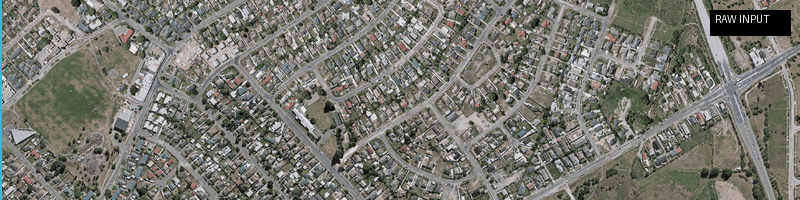

# TFNet: Tuning-Fork Network for Improved Building Footprint Extraction

<div align="center">

[](https://ieeexplore.ieee.org/document/11313886)
[](https://github.com/Muhammad-Ahmad-Waseem/DHA-Dataset)
[](LICENSE)
[](https://www.python.org/)
[](https://pytorch.org/)

**IEEE International Geoscience and Remote Sensing Symposium (IGARSS) 2025**

M. Ahmad Waseem, Muhammad Tahir, Zubair Khalid, and Momin Uppal

*Lahore University of Management Sciences (LUMS) · University at Buffalo*

</div>

---

## Overview

> **TL;DR:** Buildings in dense urban areas (especially developing countries) often touch or share walls, causing standard segmentation models to merge them into blobs. TFNet solves this with a **single encoder + two parallel decoders** — one for building masks, one for building edges — trained end-to-end. We also introduce **NePAGG**, a pre-processing pipeline that adds neighborhood context at tile boundaries. Result: **SOTA polygon-based F1 scores across all SpaceNet2 regions** and a new Lahore DHA dataset with 25,631 annotated footprints.

<div align="center">



*TFNet in action on the Lahore DHA dataset. Green = correctly detected building polygon (IoU > 0.5), Red = missed/incorrect.*

</div>

---

## Key Results

### SpaceNet2 — Polygon-Based F1 Score

| Method | # Params (M) | Vegas | Paris | Shanghai | Khartoum |
|---|---|---|---|---|---|
| DeepLabV3+ | 26.68 | 82.86 | 55.15 | 44.49 | 43.45 |
| Res2-UNet | 43.68 | 93.26 | 80.53 | 69.34 | 68.92 |
| BuildFormer | 40.52 | 86.52 | 62.97 | 44.92 | 38.21 |
| CBRNet | 22.69 | 92.94 | 78.27 | 66.37 | 63.62 |
| C³Net | 73.70 | 91.69 | 75.71 | 61.45 | 56.18 |
| **TFNet (Ours)** | **29.85** | **95.33** | **87.11** | **80.76** | **80.86** |

### Lahore DHA Dataset — Polygon-Based F1 Score

| Method | Train F1 | Test F1 |
|---|---|---|
| DeepLabV3+ | 26.55 | 25.92 |
| Res2-UNet | 83.02 | 60.59 |
| BuildFormer | 74.63 | 66.29 |
| CBRNet | 59.59 | 56.62 |
| C³Net | 91.06 | 63.88 |
| **TFNet (Ours)** | **98.95** | **77.56** |

---

## Method

### Architecture

<div align="center">

```
                    ┌──────────────┐
  Satellite Image   │   NePAGG     │   Augmented tile
  (W × H pixels) ──►  Preprocessing ──►  ((W+2k) × (H+2k))
                    └──────────────┘
                            │
                            ▼
                    ┌──────────────┐
                    │   Encoder    │  Dilated ResNet backbone
                    │  (Shared)    │  with atrous convolutions
                    └──────┬───────┘
                           │ Dense features
              ┌────────────┼────────────┐
              ▼                         ▼
    ┌──────────────┐         ┌──────────────────┐
    │ Mask Decoder │         │  Edge Decoder    │
    │ (ASPP-based) │         │  (ASPP-based)    │
    └──────┬───────┘         └────────┬─────────┘
           │ Crop to W×H              │ Crop to W×H
           ▼                          ▼
    Building Masks            Building Edges
       (Focal Loss)              (Focal Loss)
              └────────────┬────────────┘
                           ▼
                     Combined Loss
                     (End-to-End)
```

</div>

### Two Key Innovations

**1. Tuning-Fork Architecture (TFNet)**

Standard approaches use a single encoder-decoder for building segmentation. TFNet uses **one encoder + two parallel decoders**:
- **Mask Decoder** — predicts binary building footprint masks
- **Edge Decoder** — predicts building boundary/edge masks

Both decoders share the same ASPP (Atrous Spatial Pyramid Pooling) architecture and are trained jointly via a sum of two focal losses. The dual-decoder design forces the encoder to learn richer features that capture both interior and boundary information, significantly improving separation of touching buildings.

**2. NePAGG (Neighborhood Pixel Aggregation)**

Standard tiling slices buildings at boundaries, causing partial views that hurt both training and inference. NePAGG solves this by:
1. Expanding each tile by `k` pixels in all directions → tile size goes from `W×H` to `(W+2k)×(H+2k)`
2. Passing the expanded tile through the model
3. Cropping the output back to `W×H` before computing loss

This ensures every pixel at a tile boundary has access to its spatial neighborhood context. For SpaceNet2 (30cm/px imagery), `k=83` is used. For Lahore DHA (30cm/px), `k=64`.

---

## Installation

```bash
# Clone the repository
git clone https://github.com/Muhammad-Ahmad-Waseem/TF-Net.git
cd TF-Net

# Create a virtual environment (recommended)
python -m venv venv
source venv/bin/activate  # On Windows: venv\Scripts\activate

# Install dependencies
pip install -r requirements.txt
```

### Requirements

```
torch>=1.12.0
torchvision>=0.13.0
numpy>=1.21.0
opencv-python>=4.5.0
scikit-image>=0.19.0
rasterio>=1.3.0
geopandas>=0.11.0
Pillow>=9.0.0
tqdm>=4.64.0
```

---

## Datasets

### SpaceNet2

Download the SpaceNet2 dataset from [spacenet.ai](https://spacenet.ai/datasets/). The dataset covers 4 Areas of Interest (AOIs): Las Vegas, Paris, Shanghai, and Khartoum.

Expected structure after download:
```
data/
└── spacenet2/
    ├── AOI_2_Vegas/
    │   ├── images/        # GeoTIFF satellite images (650×650, 30cm/px)
    │   └── labels/        # GeoJSON building footprint annotations
    ├── AOI_3_Paris/
    ├── AOI_4_Shanghai/
    └── AOI_5_Khartoum/
```

### Lahore DHA Dataset (Custom)

Our custom dataset for dense urban buildings in Lahore, Pakistan. Available at:

[](https://github.com/Muhammad-Ahmad-Waseem/DHA-Dataset)

- **Coverage:** ~31 km² of Defence Housing Authority (DHA), Lahore
- **Resolution:** 30 cm/pixel
- **Annotations:** 25,631 building footprints
- **Splits:** 1,675 training tiles + 315 test tiles (512×512 px)

```
data/
└── lahore_dha/
    ├── images/
    │   ├── train/
    │   └── test/
    └── labels/
        ├── train/
        └── test/
```

---

## Usage

### 1. Preprocess — Generate Edge Masks

```bash
python src/preprocessing/generate_edges.py \
    --data_root data/spacenet2 \
    --output_root data/spacenet2_processed \
    --edge_width 3
```

### 2. Train

```bash
python src/train.py \
    --dataset spacenet2 \
    --data_root data/spacenet2_processed \
    --output_dir checkpoints/spacenet2 \
    --epochs 150 \
    --batch_size 8 \
    --lr 0.0001 \
    --k 83
```

For the Lahore DHA dataset:
```bash
python src/train.py \
    --dataset lahore_dha \
    --data_root data/lahore_dha \
    --output_dir checkpoints/lahore_dha \
    --epochs 150 \
    --batch_size 8 \
    --lr 0.0001 \
    --k 64
```

### 3. Inference

```bash
python src/inference.py \
    --checkpoint checkpoints/spacenet2/best_model.pth \
    --image_path path/to/image.tif \
    --output_dir results/ \
    --k 83
```

### 4. Evaluate (Polygon-Based F1)

```bash
python src/evaluate.py \
    --predictions_dir results/predictions \
    --gt_dir data/spacenet2_processed/labels/test \
    --iou_threshold 0.5
```

---

## Repository Structure

```
TF-Net/
├── README.md
├── requirements.txt
├── LICENSE
│
├── assets/                         # Figures and GIFs for README
│   ├── tfnet_demo.gif              # Detection demo animation
│   ├── tfnet_architecture.png      # Architecture diagram
│   └── qualitative_results.png     # Comparison with SOTA
│
├── src/
│   ├── models/
│   │   ├── tfnet.py                # TFNet architecture
│   │   ├── encoder.py              # Dilated ResNet encoder
│   │   └── decoder.py              # ASPP-based decoder
│   │
│   ├── data/
│   │   ├── dataset.py              # PyTorch Dataset classes
│   │   ├── transforms.py           # Data augmentation
│   │   └── nepAGG.py               # NePAGG pre-processing pipeline
│   │
│   ├── losses/
│   │   └── focal_loss.py           # Focal loss implementation
│   │
│   ├── preprocessing/
│   │   ├── generate_edges.py       # Build edge mask ground truths
│   │   └── tile_images.py          # Raster tiling utilities
│   │
│   ├── utils/
│   │   ├── metrics.py              # Polygon-based F1, IoU scoring
│   │   ├── polygon_utils.py        # Mask → polygon conversion
│   │   └── visualization.py        # Plotting predictions
│   │
│   ├── train.py                    # Training script
│   ├── inference.py                # Single-image inference
│   └── evaluate.py                 # Evaluation on test set
│
└── configs/
    ├── spacenet2.yaml              # SpaceNet2 hyperparameters
    └── lahore_dha.yaml             # Lahore DHA hyperparameters
```

---

## Training Details

| Parameter | SpaceNet2 | Lahore DHA |
|---|---|---|
| Framework | PyTorch | PyTorch |
| GPU | NVIDIA RTX 3090 (24GB) | NVIDIA RTX 3090 (24GB) |
| Epochs | 150 | 150 |
| Batch size | 8 | 8 |
| Optimizer | SGD | SGD |
| Learning rate | 0.0001 | 0.0001 |
| NePAGG `k` | 83 px | 64 px |
| Input tile size | 816×816 (with NePAGG) | 640×640 (with NePAGG) |
| Loss | Focal (mask) + Focal (edge) | Focal (mask) + Focal (edge) |

---

## Citation

If you use TFNet or the Lahore DHA dataset in your research, please cite:

```bibtex
@inproceedings{waseem2025tfnet,
  title     = {A Tuning-Fork Network for Improved Building Footprint Extraction},
  author    = {Waseem, M. Ahmad and Tahir, Muhammad and Khalid, Zubair and Uppal, Momin},
  booktitle = {IGARSS 2025 - 2025 IEEE International Geoscience and Remote Sensing Symposium},
  pages     = {6464--6468},
  year      = {2025},
  doi       = {10.1109/IGARSS55030.2025.11313886},
  publisher = {IEEE}
}
```

---

## Acknowledgements

This research was supported by the Higher Education Commission of Pakistan through grant ID GCF-521.

The SpaceNet2 dataset is provided by SpaceNet LLC. We thank the SpaceNet community for making this benchmark available.

---

## Related Work

- [SpaceNet Challenges](https://spacenet.ai/) — Building footprint extraction benchmark
- [DeepLabV3+](https://github.com/tensorflow/models/tree/master/research/deeplab) — Encoder-decoder with atrous separable convolution
- [Res2-UNet](https://github.com/Res2Net/Res2Net-Backbone) — Multi-scale feature backbone for BFE

---

<div align="center">

**Questions or issues?** Open a [GitHub Issue](https://github.com/Muhammad-Ahmad-Waseem/TF-Net/issues) or reach out via [LinkedIn](https://linkedin.com/in/Engr-Muhammad-Ahmad-Waseem).

</div>
